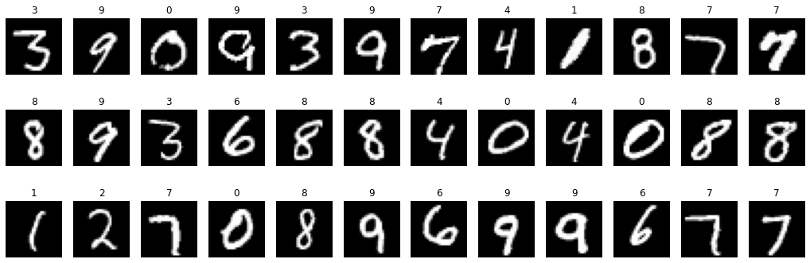
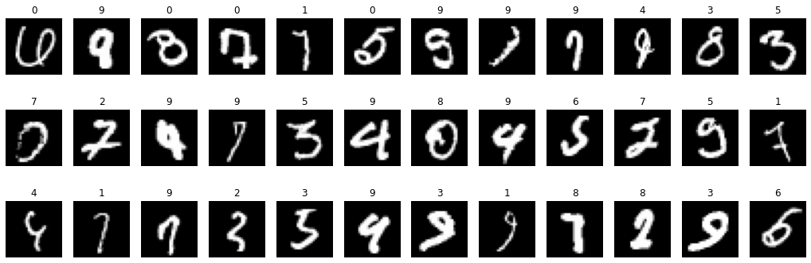

#### Challenge - 

Build a DNN Model for MNIST Dataset Provided below. Expected Test accuracy is 97 %. The model build should have the number of Neural Network parameters smaller than 1 Lakh

Data Set URL - https://www.kaggle.com/datasets/oddrationale/mnist-in-csv

#### Dataset 

